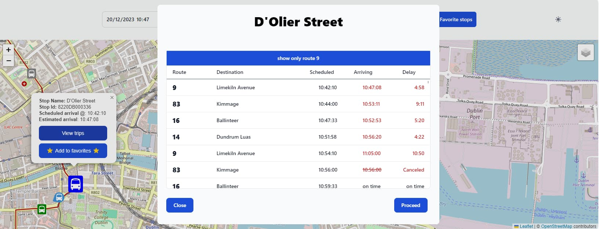

# Irish public transport tracker

> [Try the live Transport Tracker on fly.io](https://transport-tracker.fly.dev).

## Table of Contents

- [Overview](#overview)
  - [Project description](#project-description)
  - [Features](#features)
- [Project Details](#project-details)
  - [Built With](#built-with)
  - [What I learned](#what-i-learned)
  - [Continued development](#continued-development)
  - [Useful resources](#useful-resources)
- [Instructions](#instructions)
  - [Setup](#setup)
  - [Usage](#usage)
  - [Deployment](#deployment)
- [Acknowledgements](#acknowledgements)
- [Author](#Author)

## Overview



### Project Description

This is an easy to use alternative to the TFI Live transport App.

- Search public bus and train schedules across Ireland for their favorite travel routes.
- Save favorite transport stops for quick future access.
- View scheduled and real arrival estimates for upcoming trains and buses. No more wondering when your bus is actually supposed to arrive.
- Select trips to display current or estimated train or bus positions.

### Features

- Next.js rest APIs and postgreSQL database serve up-to-date schedule of public transport routes.
- Leaflet map displays interactive transport stops, route paths, arrival times, and estimated vehicle position.
- Interactive features include travel date/time picker, departure point by stop, and scheduled trip selection.
- Redis realtime transport data cache provides fast trip updates by serving only user requested trips.
- Containerized with Docker for flexible and easy deployment.
- Continuous deployment with github workflows ensures transport schedules are kept up to date.

## Project Details

### Built With

- Next.JS single page React app
- TypeScript
- Styling with CSS, Tailwind and [Shadcn/ui components](https://ui.shadcn.com)
- Leaflet Maps
- NEON PostgreSQL [See companion repo for PostgreSQL continuous deployment](https://github.com/david-abell/gtfs-to-postgres)
- Deployed with Docker containers
- Redis caching for the National Transport Authority Realtime schedule API
- [Transport for Ireland public transport data](https://www.transportforireland.ie/transportData/PT_Data.html)

### Continued Development

- Add a timeline schedule component as an alternative to the map layout.
- Add feature to search for specific stop ids.

### What I learned

#### SQlite and PostgreSQL

This project was originally deployed with a companion SQLite database deployed as part of the app docker container. This allowed users low latency access to schedule information at the expense of larger container deployment size. At inception, this container size was manageable, but in the latter part of 2023 it outgrew fly.io's build worker memory limits when schedule data served by the NTA caused container size to balloon to over 2.5GB+.

Extracting database hosting to a separate PostgreSQL service hosted on NEON added a small warm up and latency penalty but resolved all fly.io deployment memory issues.

#### SQLite database versioning and persisting values with Github workflows

Because the database serves only frequently changing transport schedule data, the simplest method for deployment was to perform a full database reset from the TFI api CSV files and then redeploy the app docker container.

Schedule data could become outdated in anywhere from a few days to a few weeks. I needed a simple way to store last modified headers from the TFI endpoint to know when the database needed to be rebuilt from fresh CSV files. Since I was discarding the database and rebuilding, I needed a separate way to store the most recent last-modified timestamp. This proved to be more difficult than expected.

Repository variables seemed like a simple place to store a string timestamp record but it turned out after a few attempts that `Actions` & `Workflows`, while they could read secrets and variables, could not be granted write permission.

Stack overflow suggested to curl the Github rest api but requests were always rejected by the api with `"message": "Resource not accessible by integration"`. I attempted variations of the job below. Setting global repository workflow permission for read and write did not work.

```yml
test:
  runs-on: ubuntu-latest
  permissions: write-all
  steps:
    - name: REST API with curl
      run: |
        value="${LAST_MODIFIED}"
        curl -L \
        -X PATCH \
        -H "Accept: application/vnd.github+json" \
        -H "Authorization: Bearer ${{ secrets.GITHUB_TOKEN }}" \
        -H "X-GitHub-Api-Version: 2022-11-28" \
        https://api.github.com/repos/${{ github.repository }}/actions/variables/GTFS_LAST_MODIFIED \
        -d '{"name":"GTFS_LAST_MODIFIED","value":"${value}"}'
```

Storing a text file with workflow artifacts seemed to be the only in house possibility but they were cumbersome to work with. Importing and exporting artifacts between jobs in a workflow proved fairly simple but it turns out that, like environment variables, there is no method for sharing them between workflow runs. Elio Struyf's article [Retrieving an artifact from a previous GitHub Actions workflow](https://www.eliostruyf.com/retrieving-artifact-previous-github-actions-workflow/) saved me the hassle of figuring out how to grab the most recently generated artifact.

The repository public workflow apis available at `https://api.github.com/repos/<OWNER>/<REPO>/actions/artifacts` and `https://api.github.com/repos/<OWNER>/<REPO>/actions/workflows/<workflow-filename>/runs` were especially helpful for understanding the api response structure and successfully retrieving the correct artifact.

<!-- [workflow_api](https://api.github.com/repos/david-abell/transport-tracker/actions/workflows/check-database-version.yml/runs) -->

<!-- [artifact_api](https://api.github.com/repos/david-abell/transport-tracker/actions/artifacts) -->

## Instructions

### Setup

`npm install`

For caching local live schedule data clone the REDIS server repo [fly-transit-redis](https://github.com/david-abell/fly-transit-redis), install, build the docker container and ensure that it is running.

For local schedule data clone the PostgreSQL repo [https://github.com/david-abell/gtfs-to-postgres](https://github.com/david-abell/fly-transit-redis), install, follow instructions to build the docker container and populate the PostgreSQL database, and ensure that the container is running.

create a `.env` file in the project root with `DATABASE_URL='PostgreSQL connection string`

### Usage

then

- `npm run dev`

  or

- `npm run build && npm run start`

### Deployment

Deployment is automated with Github workflows `push`` or `merges` to main and nightly API checks to the TFI GTFS API. For live schedule updates a separate fly.io redis server must be created.

#### deploy to Fly.io

- install flyctl available from [fly.io](fly.io)
- run `fly launch`
- run `fly secrets set DATABASE_URL=postgreSQL connection string`
- run `fly secrets set NTA_REALTIME_API_KEY=api key from NTA GTFS realtime api below`
- run `npm run deploy`

## Useful resources

- [Transport operator schedule data](https://www.transportforireland.ie/transitData/PT_Data.html)
- [NTA GTFS realtime api](https://developer.nationaltransport.ie/api-details#api=gtfsr&operation=gtfsr-v2)
- [General transport feed specifications](https://gtfs.org)

## Author

- [see my portfolio](https://david-abell.github.io/personal-portfolio/)
- [visit my LinkedIn](https://www.linkedin.com/in/davidabell722/)

## Acknowledgements

- Elio Struyf's article mentioned above [Retrieving an artifact from a previous GitHub Actions workflow](https://www.eliostruyf.com/retrieving-artifact-previous-github-actions-workflow/)
- I relied heavily on Brendan Nee @BlinkTagInc and [node-gtfs](https://github.com/BlinkTagInc/node-gtfs) for initial SQLite database trials.
